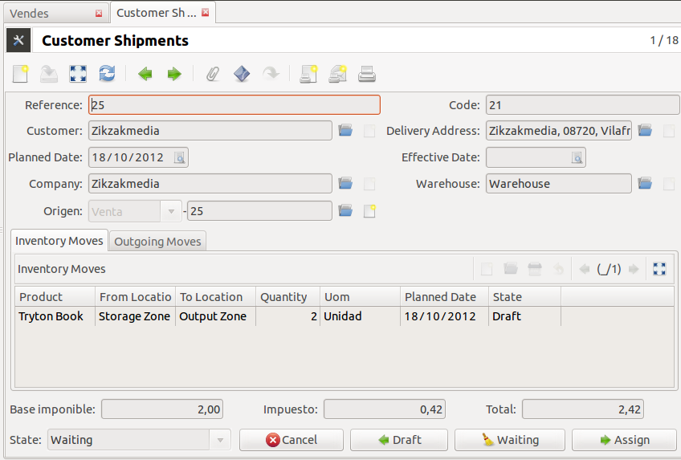

===================
Albaranes valorados
===================

Añade importe base, impuestos e importe total a los albaranes.

.. note:: Sólo los usuarios que pertenezcan al grupo **Precios en stock** verán
          los precios en los albaranes.

Si ha instalado el módulo
`Descuentos en pedidos de venta <../sale_discount/index.html>`_, recuerde
también instalar el módulo
`Albaranes valorados con descuentos <../stock_valued_discount/index.html>`_.

Módulos que dependen
====================

Instalados
----------

.. toctree::
   :maxdepth: 1

   /account/index
   /account_invoice/index
   /account_product/index
   /product/index
   /stock/index

Dependencias
------------

* Contabilidad_
* Facturación_
* `Contabilidad producto`_
* Producto_
* Stock_

.. _Contabilidad: ../account/index.html
.. _Facturación: ../account_invoice/index.html
.. _Contabilidad producto: ../account_product/index.html
.. _Producto: ../product/index.html
.. _Stock: ../stock/index.html
 